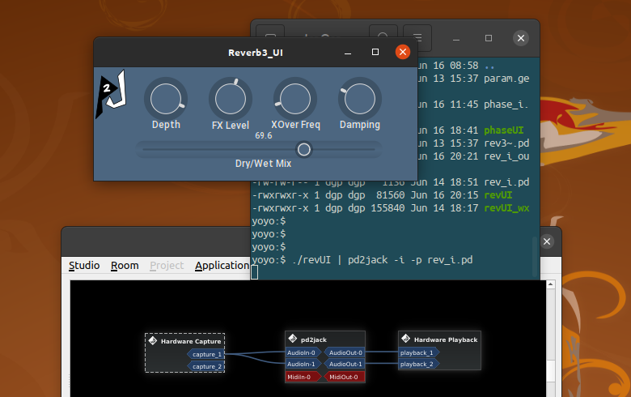
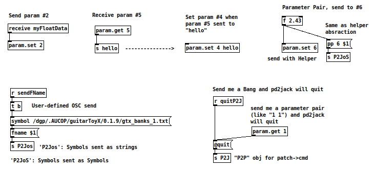
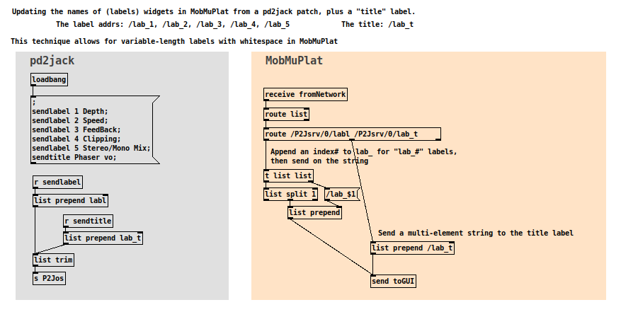
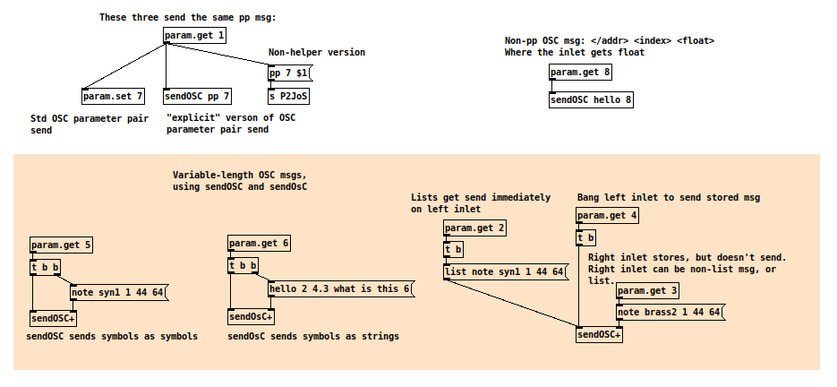

## pd2jack Interactive Mode

[Return to the main README](README.md)

*Interactive mode* (-i) enables real-time data input into **pd2jack**. *Interactive mode* is split into two modes of operation:

   1. Parameter Pairs
   2. Interactive Mode Special Commands

### Parameter Pairs in *Interactive Mode*

Any "live stream" input of parameter pairs (in the console) will be passed on as "param" messages to the Pd patch. These work like the startup "parameter pairs," except for:

- No quotes are required
- Each pair is terminated with a newline

A stream of pairs might look something like this:

```
1 89
1 88
1 87
1 86
3 2180
3 2200
3 2221
3 2241
3 2261
4 19
```
Parameter pairs can be entered by hand to the console...or data can be 'piped' into the standard input.

See the **IPC section** at the bottom of this page.

## Interactive Mode Special Commands (w/ "@" prefix)

Interactive mode also includes a set of special cmds, for controlling some internal operations. Each of these cmds is preceeded with an "at" symbol (@), to differentiate the cmds from the parameter stream. Here's a list:

### The (IMode) commands

Enabled with the -i option; data is console text input.

#### Conventions:

    <recv>		:	a "receive object" name in Pd, [receive name] or [r name], usually a symbol
	<recv#>		:	an integer (acting as a "receive object" symbol) and the first element of a parameter pair
    <something>	:	an argument

  * All **I Mode** commands (except for Parameter Pairs) begin with an AT symbol '@', to differentiate them from the pairs. So "parameter pairs" are processing and transferred very quickly.
  * All cmds are entered with a line feed.

Parameter Pairs are two numbers, separated with a space:

    <param# paramValue>

  * param# : an integer; the *name* of the receiver obj in Pd (use "param.get.pd")
  * paramValue : a float; the value passed

## The Commands
_________________________________________________________________________________________________

### LibPd/Pd settings

	@openpatch <path/name>         : Opens a patch file. Multiple patches can be open concurrently
	@closepatch <index optional>   : Close the patch <index#>. No arg == close all patches. Arg 0 == close first patch
    @closelastpatch                : Close the last opened patch
	@dsp  <0:1 optional>           : Turn DSP On/Off.  No arg == dsp ON (1)
	@dspoff                        : Turn OFF DSP
	@bypass <0:1 optional>         : Bypass Pd processing, On/Off. No arg == bypass ON (1)
	@bypassoff                     : No bypass, processing performed

### Direct data send

	@sendbang <recv>				: Send Bang to a receive obj
	@sendfloat <recv> <float>		: Send Float to a receive obj
	@sendsymbol <recv> <symbol>	    : Send Symbol to a receive obj

### Compound msg data send

	@startmsg						: Start a compound message
	@addfloat <float>				: Add Float to a compound message
	@addsymbol	<symbol>			: Add Symbol to a compound message
	@endmsg <recv> <symbol>			: Finish (& send) a compound message
	@endlist <recv>					: Finish (& send) a compound list

### Compound Message Examples

Compound message "List" example:


    @startmsg
    @addsymbol hello
    @addfloat 1.23
    @endlist test

                        sends [list hello 1.23( -> [r test],
                        Use the [list trim] object on the receiving end, if needed

Compound message, "Message" example:

    @startmsg
    @addsymbol hello
    @addfloat 1.23
    @endmsg test msg1

                        finishMsg sends a typed message -> [; test msg1 hello 1.23(

Compound Msg examples adapted from LibPd's "PdBase.hpp" include file.

### Receive Data

Param pairs:

	<param#> <float>				: the basic parameter pair - "recv# value"
 	@ppname <new_name>			    : Set the parameter pair receive name; no arg == reset to "param"

I.E., the preset, standard receiving object *name* for the abstraction **param.get.pd** is "param" and all parameter pairs are sent to that receive obj name. But another receive object is easy to make (as well is making a modified **param.get.pd** abstraction).

The *receive obj name* is added internally to the parameter pair by **pd2jack**.

### MIDI commands

While the standard way to input MIDI to a Pure Data patch is via the MIDI ports, MIDI data can also be sent to the patch via special commands.

    @sendnote <chan> <pitch> <velo>         : NoteOn (there is NO NoteOff in Pd, use @sendNote w/ 0 velocity)
    @sendcc <chan> <cont#> <val f>          : Continuous Controller
    @sendprogc <chan> <val f>               : Program Change
    @sendpbend <chan> <val f>               : Pitch Bend
    @sendaftert <chan> <val f>              : Aftertouch
    @sendpolyat <chan> <pitch> <val f>      : Poly Aftertouch

    @sendmidib <port> <byte>                : Send a MIDI byte
    @sendsysex <port> <byte>                : Send a MIDI Sysex byte
    @sendsysrt <port> <byte>                : Send a MIDI Realtime byte

    @n <chan> <pitch> <velo>    : Short version of @sendNote
    @c <chan> <cont#> <val f>   : Short version of @sendCC
    @b <chan> <val f>           : Short version of @sendPBend
    @s <port> <byte>            : Short version of @sendSysex

### Non-Pd cmds

	@quit							: Exit pd2jack
    @imode <0:1>                    : Interactive mode, on/off
    @oscmode <0:1>                  : OSC on/off
    @setid <symbol_name>            : set identifier for OSC msgs
	@sleeptime <ms>				    : Delay (5 - 500 milliseconds) between I Mode data fetch (console)
	@prompt <0:1>					: Turn prompt on (1) or off (0), in I Mode
	@setprompt <a text str >;		: Set the prompt string; terminate with semicolon (trailing spaces OK)
	@-e								: Get status / last error
	@-v								: Return version #

## IPC control of pd2jack

pd2jack has two methods of Inter-Process Communication: **pipes** and **OSC**.

### Using Pipes

Among the implications, a separate GUI application can act as a front-end, and pipe it's data into *pd2jack*. 

So *ANY* GUI api could be used...just convert any input to parameter pairs and print them to the console. This isn't a crazy as it sounds -- two applications connected with a pipe are separate processes, and if the numeric char strings aren't actually printed to the console (they are not, with pipes), the CPU load is pretty small.

Pipes work with any *Interactive Mode* commands, not just parameter pairs.

Here's a example of how it's invoked:

    ./revUI | pd2jack -i -p rev_i.pd

    Where "revUI" is the gui, and **pd2jack** is running the "rev_i.pd" patch

And here's how it looks (with a simple XPutty GUI):



There are other options for IPC with Pd (netsend, netreceive & some custom objects) and piping the console might feel like a hack, but it is simple and quick. An additional method (sockets?) might be added to **pd2jack** in the future...(yeah, I'm thinking maybe a plugin interface).

It's also been suggested this mode might be useful for people with disabilities. I've also successfully piped the output of *pd2jack* to a speech synthesis module, sending text via **Pure Data**'s [print] object, as well as any info output in "verbose" mode.

## Using OSC

Instead of pipes, there's a better way: OSC, or *Open Sound Control*. OSC also offers bi-directional communication.

So, why have external OSC support for *pd2jack*, when OSC is built into **Pure Data**? One important reason is the IMode commands, they should be accessable from *outside* the patch, i.e., by a client. Another reason is portability -- transfer Pd patches with minimal changes to *pd2jack*. Simplicity is important, too.

### Set the ID # (Descriptor)

Each instance of pd2jack can have a unique ID integer. Set the ID with the optional argument -d, from the console at startup:

    -d <int>        An integer identifier

    Example:
    -d 2

All OSC packets include that identifier, which can be used to target different instances of *pd2jack*, and separate client apps. That holds for both input and output.

### The OSC URL

The OSC URL is sent to stdout on startup if pd2jack is invoked with the verbose option (-v 1). It will output *something* like this:

    Version: 0.X.0
     -Audio: 2:2 -Midi: 1:1
     -ID: 0
     -OSC server URL: osc.udp://mycomputer-0xx:20331/ Out: osc.udp://224.0.0.1:20341/

In default mode the OSC address should work with clients running on the local machine, and remote clients (TouchOSC or MobMuPlat) can send OSC data **to** *pd2jack*. To send outgoing data to remote clients, the -O option should be set to the multicast group:

    -O 224.0.0.1

For example, here's a common way of invoking in verbose interactive mode, OSC enabled, and sending OSC to a group multicast addr (communicating with an external device on a local router):

    pd2jack -v 1 -i -o -O 224.0.0.1 -p pd/phase_vo.pd

## Helper Abstractions

Helper abstractions are small Pd code blocks that hide some basic functionality, for the sake of simplicity.

**Sending**

    param.set.pd            [param.set <param#> <optional obj name>]    + one data inlet

    sendOSC.pd              [sendOSC <addrName> <#>]                    + one data inlet
        Works like a pp obj, but with any /name
        Sends name (in addr), # (an index), and a float (data)

    sendOSC+.pd             [sendOSC+]              + inlet1: bang to send, lists sent immediately
                                                    + inlet2: sets message
                                                        [<Name> <data .... data>( (data field variable)

    sendOsC+.pd             [sendOsC+]              Like [sendOSC+], but sends symbols as strings

**Receiving**

        param.get.pd        [param.get <param#> <optional obj name>]    + one data outlet

## Examples

Some general example on using OSC, some with the "helper" abstractions, some without.



**Below:** Sending variable-length strings to a client (stand-alone gui, MobMuPlat), to change widget labels. Of course this isn't the only way to send string data, but illustrates it's sufficiently flexible for user-defined solutions.

In this case the patch uses the "P2Jos" (lower-case 's') that converts Pd Symbols to the "OSC string type" and that makes sending whitespace-separated strings a bit easier for some client applications.



Note: the above illustration is fragments from two separate patches (server and client), and wouldn't, by itself, do anything.

**Below:** Examples of Helper abstractions for sending variable-length OSC msgs:



## OSC - Actual Message Data

This is important, particularly for writing clients.

### OSC msg formats : the server (pd2jack instance)

A running instance of *pd2jack* (server) **sends** outgoing OSC msgs in this format:

    /P2Jsrv/<ID>/<type> <data .. data>

        where:  <ID>    is a unique integer identifier for this instance (must be set explicity)
                <type>  is the type of message:
                        P2JoS   A Pd list sent in SYMBOL format, from the [send P2JoS] obj in the patch
                        P2Jos   A Pd list sent in STRING format, from the [send P2Jos] obj in the patch
                <data>  is any data that follows the type

    For example, a parameter pair:
        /P2Jsrv/0/P2JoS pp 2 2.45                       Obj in patch: [s P2JoS]

The first symbol/string in the data field can (should, generally) be a *directive*, like the **pp** example. This puts a bit more overhead on the client, but makes for a very flexible approach when sending data from the Pd patch.

Abstractions and subpatches can hide most of the complexity of sending OSC data ("Helper" abstractions), and the *language* of **Pure Data** makes it very configurable.

**P2joS** sends all character strings as OSC **symbol** type, **P2Jos** sends all character strings as OSC **string** type.

The *pd2jack* parent can also receive IMode cmds directly (from a patch) with:

    /P2J/<cmd>  <data .. data>

    For example, a Quit cmd:
        /P2J/@quit                                      Obj in patch: [s P2J]

In the case of patch->pd2jack cmds, they are handled internally (not sent via network). The "P2J" receive obj is only valid in the parent *pd2jack* instance, so no ID numbers are used.

### OSC msg formats : the client (external control)

A client sends messages to a **receiving** pd2jack instance like this:

    /P2Jcli/<ID>/<type> <data .. data>

        where:  <ID>    is the unique integer identifier for the target pd2jack instance
                <type>  is the type of message:
                        pp      A parameter pair, routed to [receive param] in the patch
                        cmd     An interactive cmd (internal pd2jack "@" cmd)
                        P2JoR   A Pd list, received by a [receive P2JoR] obj in the patch
                <data>  is any data that follows the type

    For example, sending an IMode command:
        /P2Jcli/0/cmd @quit                             Not received by patch

    Sending a parameter pair:
        /P2Jcli/0/pp 4 5.2                              Obj in patch: [r param]

    Sending any other data:
        /P2Jcli/0/P2JoR filenm ./pd/myfile.pd           Obj in patch: [r P2JoR]

A parameter pair sent from a client to pd2jack via OSC is sent to the receive obj "param" in the patch. The "pp" OSC message is converted before it's passed (of course so is the cmd msgs). Only the OSC msgs sent to P2JoR are passed verbatum - and to the [receive P2JoR] object.

The "param" receive object is the only data-specific OSC object definition in *pd2jack*, and was added (early in development) to facilitate the use of **Camomile** helper abstractions ("param.get.pd"). The other defined receive objs are more flexible. Of the original **Camomile** abstractions, *param.get.pd* is unedited, but *param.set.pd* has been altered (the "Camomile" obj and other code removed).

Some of the messaging format is hidden inside the helper abstractions, of course. Other formatting is transparently performed by *pd2jack* (appending client/server address, and the ID#).
