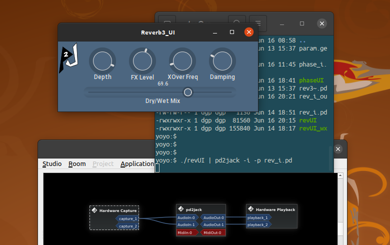

## pd2jack

...is a shell application for running **Pure Data** patches as minimalist JACK clients, using **LibPd**. I.E., the patches run "headless" and without a GUI. However, parameters can be passed to the patch from the cmd line. See "Passing Parameters" below...

Now in beta release, **pd2jack** has currently only been tested on Linux.

### Features

 - Up to 16 audio ports and/or 16 MIDI ports can be opened per instance. Ports are defined at startup with cmd arguments, not by the Pd patch.
 - Parameters can be passed to the Pd patch from the shell (not interactively, currently).


Example patch "synths.pd" (shown in the *Claudia* patchbay)


Above example invoked with (**pd2jack** installed, current dir: *pd2jack/pd* ):

    pd2jack -n Synths -m 3:0 -a 0:3 -s -p synths.pd

The patch is a very simple example of routing by MIDI port/channel offsets.


See the "MIDI ports" section below for an explanation of this patch...

### Startup Options

```
Help: pd2jack <options> -p 'file.pd' <'param strs'>
-p : Pd patch Name, with valid path

 Optional args:
-a : Audio ports (0-16) - default: 2:2 
-h : Help msg
-i : Interactive mode
-m : Midi ports (0-16) - default: 1:1
-n : JACK port Name - default: pd2jack
-s : Silence Pd [print] objects (no args) - default: Not silent
-v : verbosity (0-1) - default: 0

```

**Quit:** CTRL C

## Examples

**Simple:**

    pd2jack -p inout.pd

Open the patch "inout.pd" in the current dir, with the default settings.

**Using all options:**

    pd2jack -p ./pd/rev_ctrl.pd -n MyPatch -s -v 1 -a 2:2 -m 1:0 '1 90' '2 99' '3 0.7'

Open "./pd/rev_ctrl.pd" with:

 - Client name: MyPatch
 - Silence print objects
 - Verbosity level 1 (echo settings)
 - JACK Audio ports: 2 inputs, 2 outputs
 - JACK MIDI ports: 1 input, no outputs
 - Parameter pairs: 3

## Pd patches (examples and utilities)

There are two folders with Pd patches included:

 - pd 
     - Example patches for loading into *pd2jack*.
 - pd_util
     - Testing utilities for midi data (to run in a **Pure Data** install, for testing *pd2jack*).

## Detailed Info
### Audio ports

Audio port data is passed to/from the patch in standard Pd "interleaved" data. It's accessed by the patch with the standard adc~ and dac~ objects, and is routed internally to those conventions.

For instance, four audio *input* ports can be accessed thusly:

    [adc~ 1 2 3 4]

Another option (there are many with 16 ports):

    [adc~ 1 3] [adc~ 2 4]
    
    [dac~ 2 3] [dac~ 1 4]

The patch "A4x4_swap.pd" routes audio inputs 1 & 2 to outputs 3 & 4, and inputs 3 & 4 to outputs 1 & 2 (This example is relatively meaningless, of course, since I/O routing is the speciality of JACK):


Four audio I/O ports (and no MIDI ports) can be opened by invoking pd2jack thus:

    pd2jack -a 4:4 -m 0:0 -p ./pd/A4x4_swap.pd

NOTE: pd2jack doesn't open JACK ports based on the Pd patch; those are defined on the cmd line.

### MIDI ports

MIDI ports follow the **Pure Data** convention: internal MIDI data is routed to & from external (JACK) ports with "channel offset" values.

The first MIDI **input** port (MidiIn-0) passes data to the patch on the "standard" MIDI channels -- 1-16 (or 0-15 programmatically).

Each additional MIDI port adds an offset of 16. So input port 2 (MidiIn-1) routes data to the patch on channels 17-32, port 3 converts to channels 33-48, etc.

Likewise for MIDI **output**: data output from the patch with the channel offset of +16 (channels 17-32) is sent and output on MIDI output port 2 (MidiOut-1). 

The opening pic and patch (top of this page -- synths.pd) demonstrate these concepts.

**NOTE: These are "virtual" MIDI channels that only Pure Data recognizes internally. This "Channel Offset" approach doesn't work with normal MIDI messages, and is NEVER routed through JACK or ALSA.**

### Note On / Note Off

Incoming JACK MIDI NOTE_OFF msgs are converted to NOTE_ON, Velocity=0, per the Pd convention.

LibPd doesn't even include NOTE_OFF in the api, so no conversion on outgoing data. A NOTE_ON, Velocity=0 *could* be returned to the JACK MIDI port as NOTE_OFF. But it's not happening here, currently. 

Those messages wouldn't be output by Pure Data, anyway. Can't even happen in Pd Vanilla, at least. 

### Pitch Bend Messages

The example patch "inout.pd" illustrates the conversion (within the patch) between incoming bend data (0-16383) to the outgoing (-8182 to 8191) data convention. The objects **bendin** and **bendout** aren't consistent.

This patch also demonstrates the "channel offset" aspect of Pd, as each Pd object is in *Omni* mode if a channel # isn't present. It simply copies MIDI data from the inputs to the outputs, which mirrors the incoming port # to the output port #.

So MIDI data entering on in port 2 will exit on out port 2; likewise 1->1, 2->2, 3->3 ..., etc. *Obviously, the data can be re-routed to another port, in the patch.*


From the *midi-help.pd* documentation patch:

```
Known bug: [bendin] and [bendout] are inconsistent. 
While [bendin] outputs values from 0 to 16383, [bendout] takes 
values from -8192 to 8191 - this won't change.
```

The part of "inout.pd" that's *pitchbend* specific:

    [bendin     ]
     |         |
    [- 8192]   |
     |         |
    [bendout    ]

Basically, **pd2jack** *shouldn't* make conversions on outgoing data (it doesn't), if **Pure Data** doesn't.

Hey -- it's Pd...(shrug)

### MIDI Timing

Both MIDI **Clock Tick** and MIDI **Time Code** (MTC) messages can be sent & received through *pd2jack*. MIDI clock tick messages have been generated and tested with Pure Data itself as a source, and routed to both *Qtractor* and *Ardour*.

MTC code was tested with the LV2 plugin **Midi Timecode (MTC) Generator**, and fed through to *Ardour*. This hasn't been extensively tested, but it works.

## MIDI Real Time messages

Some corrections to the Pd "port #" offset are made for RT message, as it's documented that sending RT introduces an unwanted offset.

### Big Five RT:
 - Timing Clock
 - Start (song)
 - Stop
 - Active Sensing
 - System Reset

Currently, *pd2jack* only sends the **Big Five** via the **LibPd** *sendSysRealTime()* function. The other messages are transferred with *sendMidiByte()*. It's possible that a hybrid approach could work (send the first byte with *sendSysRealTime()* and the data via *sendMidiByte()* ). There is very little documention on the subject in LibPd.

There's an option to redirect the patch->libpd RT output to the more generic *sendMidiByte()*, rather than as a system RT byte. This option is currently not documented, but is set with a Pd message (more on that, eventually).

## Passing Parameters

Parameters *can* be passed (from the shell) to the Pd patch with this simple technique - a pair of numbers in the format:

     parameter# parameter_value

Since the separator in the pair is a space, quotes are required. Here's an example of three parameters:

    '1 90' '2 99' '3 0.7'

Any arguments without a preceeding *-option* are assumed to be parameter pairs. If the pair is "unparsable" (two strings, for instance) **LibPd** will either send garbage to the patch, or *possibly* just ignore them. Single-number strings will trigger an error. 

The patch "rev_ctrl.pd" illustrates how these three parameters are received by a Pd patch, via the *param.get* object:


Invoke this patch with:

    pd2jack -p rev_ctrl.pd -n Reverb -a 2:2 -m 1:0 '1 90' '2 99' '3 0.7'

**Prerequisites** -- the Pd abstraction *param.get.pd* must be in the pd directory.

### What's happening...

This technique is used to pass Pd parameters in Pierre Guillot's **Camomile**, a cross-platform **Pure Data -> plugin API**. I *appropriated* the technique (and the abstraction) because it's simple & fast (and it's easy to use Camomile patches).

In short, the pair '1 90' would be sent to the patch in the form (internally):

    param 1 90
        or
    "param" <parameter#> <parameter_value>

Where the parameter# is the identifier used by *param.get.pd*, and the parameter_value is the value sent. The "param" string is the name used for Pd **send** & **receive** objects.

Of course, "param" is added by **pd2jack** and send to the patch with the rest. 

While the *param.get.pd* abstraction makes the process easy, in it's simplest form, think of it like this in the Pd patch (with three "number pairs" entered):

    [receive param]
    |
    [route 1 2 3]
     |   |   |
     |   |  [process value passed with 3]
     |  [process value passed with 2]
    [process value passed with 1]

YES, it would be trivial to add **named** send/receive pairs to this application. I.E., to replace the *parameter#* prefix with a custom parameter string, and send that to a named *receive* object in the patch.

## Interactive Mode

New with v0.1.8, enabling *interactive mode* (-i) interprets any "live stream" input of parameter pairs (in the console) to be passed on as "param" messages to the Pd patch. These work like the startup "parameter pairs," except for:

- No quotes are required
- Each pair is terminated with a newline

A stream of pairs might look something like this:

```
1 89
1 88
1 87
1 86
3 2180
3 2200
3 2221
3 2241
3 2261
4 19
```

NOTE: **this has some cool implications** -- a separate GUI application can act as a front-end, and "pipe" data into *pd2jack*. 

So *ANY* GUI api could be used...just convert any input to parameter pairs and print them to the console. This isn't a crazy as it sounds -- two applications connected with a pipe are separate processes, and if the numeric char strings aren't actually printed to the console (the are not, with pipe), the CPU load is pretty small.

Here's a example of how it's invoked:

    ./revUI | pd2jack -i -p rev_i.pd

And here's how it looks (with a simple XPutty GUI):



There are other options for IPC with Pd (netsend, netreceive & some custom objects) and piping the console might feel like a hack, but it is simple and quick. An additional method (sockets?) might be added to **pd2jack** in the future...(yeah, I'm thinking maybe a plugin interface).

It's also been suggested this mode might be useful for people with disabilities. I've also successfully piped the output of *pd2jack* to a speech synthesis module, sending text via **Pure Data**'s [print] object, as well as any info output in "verbose" mode.

### Interactive Mode Special Commands (w/ "@" prefix)

Interactive mode also includes a set of special cmds, for controlling some internal operations. Each of these cmds is preceeded with an "at" symbol (@), to differentiate the cmds from the parameter stream. Here's a list:

```
@openPatch <name>     : load a different patch into the LibPd space (closes current patch first).
@closePatch           : closes the current patch
@reopenPatch          : reopens the last valid patch (patch can be closed or already open)
@im_sleepTime <int>   : sleep time (ms, 5-500) between data fetches for interactive mode.
```

Invoking "@reopenPatch" on an already open patch will *reload* the patch.

## Compiliation and Installation

The *pd2jack* app is built on and requires **LibPd**. A **LibPd** build is dependent on a current **Pure Data** installation (source and build). The **Pure Data** distribution is a subdir in a **LibPd** install. **LibPd** and it's dependencies are a submodule of the *pd2jack* GIT.

As of the first "official" release *pd2jack* is currently statically-linked to the **LibPd** Library (libpd.a). This results in a larger executable, but as *LibPd* isn't widely available in a distro package format (deb, rpm, etc), it's the only way to distribute the project without building the dependencies from source (AFAIK, the library isn't pre-compiled for Ubuntu, for instance).

Building from source is a good idea, though. Here's how:

## Clone pd2jack

Create a folder where source and build will reside, then open a console and enter:

    git clone --recurse-submodules https://github.com/GModal/pd2jack.git

Cloning the project recursively will also clone the sources of **LibPd** and **Pure Data**.

## Build and install pd2jack

A simple *Makefile* is included. Open a console in the *pd2jack* build folder, and enter:

    make

**Optional**: the size of the executable can be reduced (by ~10%) by entering:

    strip pd2jack

And if it's to be installed system-wide:

    sudo make install

### Links:

- [Camomile](https://github.com/pierreguillot/Camomile)
- [libpd](https://github.com/libpd)
- [Pure Data](https://puredata.info/)
- **pd2jack** is a package in *The openSUSE DAW:* [Geekos DAW](http://geekosdaw.tuxfamily.org/), Repository:  [Geekos DAW repository](https://build.opensuse.org/project/show/home:geekositalia:daw)

### Special Thanks To:

 - Fabio, for assistance with the build process.

