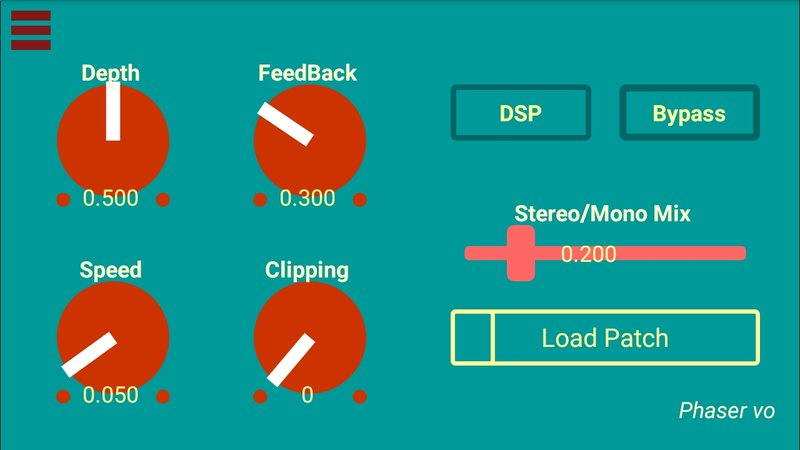

## pd2jack OSC Clients

A running instance of *pd2jack* can act as an OSC server, with a networked client acting as a GUI. Examples can be found in the **client** folder.

## Swap

Swap is a demo app that switches between two patches. It comes in multiple versions for different GUI frameworks (GLV, xputty, MobMuPlat).

### MobMuPlat *Swap*

**On MobMuPlat:** The contents of the client/mobmuplat/swap folder should be tranferred to the MobMuPlat working folder on your device (iOS or Android). Only two files are required:

    swap.mmp
    swap.pd

From the "Network" menu (start w/upper left menu, then click three dots on upper right, chose Network):
Select:

   - **Multicast & Direct**
   - Broadcast IP address: 224.0.0.1
   - Output Port:            20331
   - Input Port:             20341

Then return to the "Documents" menu.

Start the MobMuPlat app, then load "swap.mmp" from the documents prompt (upper left corner). You'll see a an interface very much like this:

**On Linux:** From the pd2jack directory, run:

    pd2jack -v 1 -i -o -O 224.0.0.1 -p pd/phase_vo.pd

    or if pd2jack isn't globally installed:
    ./pd2jack -v 1 -i -o -O 224.0.0.1 -p pd/phase_vo.pd

This will start *pd2jack* in verbose interactive mode, with OSC enabled and a multicast group for outgoing OSC. The URL of 224.0.0.1 is standard for home routers, but could be different on commercial or education networks. This also holds for the MobMuPlat broadcast IP address.

(The patch paths (in "swap.pd") are set for the subdir "pd", so the demo won't function unless the patches are in that folder. Edit "swap.pd" if other behavior is preferred.)

### Using the Swap client

   - Changing a widget will alter the values in the patch.

   - Select "Load Patch" and choose one of the two patches to load. **pd2jack** will clear the previous patch, and load the new one. The widget labels will change to correspond with the new patch.

Instructions for installing MobMuPlat can be found on the website: [MobMuPlat home.](https://danieliglesia.com/mobmuplat/)

## Other versions of Swap 

Other versions (and future client examples) can be found as "release assets" with each major release of pd2jack. As those become less alpha, they'll be moved to the *client* folder.

(The c versions work well, but there hasn't been time to construct makefiles, etc.)
